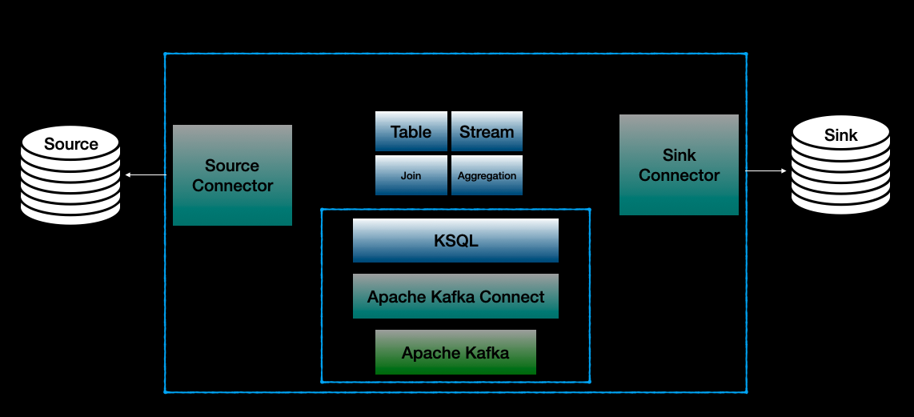

# Streaming ETL Using Kafka Connect & KSQL DB

This is a demo project for demonstrating data extraction from multiple tables/databases using debezium, joining them on the fly using ksqldb and storing into a different table/database.



## Starting up the architecture

In order to run the infrastructure you should build and run the docker-compose file.

```bash
> docker-compose -f docker-compose.yml up --build --no-start
```

Start every container described in the `docker-compose.yml`,

```bash
> docker-compose -f docker-compose.yml start
```

## Building the ETL Pipeline

First we should create a source connector (debezium) for listening the changes in the inventory schema objects. First things first we should open up a terminal to connect to Ksql Server by running the following command, after that we will be using the terminal of ksqldb client created here.

```bash
> docker-compose exec ksqldb-cli  ksql http://primary-ksqldb-server:8088
```

### Create Source Connector

The script for the source connector is avaliable at [mysql_source_connector](./mysql_source_connector.sql)

```bash
ksql> CREATE SOURCE CONNECTOR `mysql-connector` WITH(
>    "connector.class"= 'io.debezium.connector.mysql.MySqlConnector',
>    "tasks.max"= '1',
>    "database.hostname"= 'mysql',
>    "database.port"= '3306',
>    "database.user"= 'root',
>    "database.password"= 'debezium',
>    "database.server.id"= '184054',
>    "database.server.name"= 'dbserver1',
>    "database.whitelist"= 'inventory',
>    "table.whitelist"= 'inventory.customers,inventory.products,inventory.orders',
>    "database.history.kafka.bootstrap.servers"= 'kafka:9092',
>    "database.history.kafka.topic"= 'schema-changes.inventory',
>    "transforms"= 'unwrap',
>    "transforms.unwrap.type"= 'io.debezium.transforms.ExtractNewRecordState',
>    "key.converter"= 'org.apache.kafka.connect.json.JsonConverter',
>    "key.converter.schemas.enable"= 'false',
>    "value.converter"= 'org.apache.kafka.connect.json.JsonConverter',
>    "value.converter.schemas.enable"= 'false');
```

After that you should be able to see the topics for the tables residing in the inventory schema at mysql.

```bash
ksql> show topics;
```

> **_NOTE:_** In order to keep the offset at begining during the demo please run the following command!
>
>```bash
>ksql> SET 'auto.offset.reset' = 'earliest';
>````

### Create Transformations with Streams and Tables

Run the following script which is avaliable in [transformation_scripts](./transformation_scripts.sql) creating stream and tables for the transformation.

```bash
ksql> CREATE STREAM S_CUSTOMER (ID INT,
>                       FIRST_NAME string,
>                       LAST_NAME string,
>                       EMAIL string)
>                 WITH (KAFKA_TOPIC='dbserver1.inventory.customers',
>                       VALUE_FORMAT='json');
>
>CREATE TABLE T_CUSTOMER
>AS
>    SELECT id,
>           latest_by_offset(first_name) as fist_name,
>           latest_by_offset(last_name) as last_name,
>           latest_by_offset(email) as email
>    FROM s_customer
>    GROUP BY id
>    EMIT CHANGES;
>
>CREATE STREAM S_PRODUCT (ID INT,
>                       NAME string,
>                       description string,
>                       weight DOUBLE)
>                 WITH (KAFKA_TOPIC='dbserver1.inventory.products',
>                       VALUE_FORMAT='json');
>
>CREATE TABLE T_PRODUCT
>AS
>    SELECT id,
>           latest_by_offset(name) as name,
>           latest_by_offset(description) as description,
>           latest_by_offset(weight) as weight
>    FROM s_product
>    GROUP BY id
>    EMIT CHANGES;
>
>CREATE STREAM s_order (
>    order_number integer,
>    order_date timestamp,
>    purchaser integer,
>    quantity integer,
>    product_id integer)
>    WITH (KAFKA_TOPIC='dbserver1.inventory.orders',VALUE_FORMAT='json');
>
>CREATE STREAM SA_ENRICHED_ORDER WITH (VALUE_FORMAT='AVRO') AS
>   select o.order_number, o.quantity, p.name as product, c.email as customer, p.id as product_id, c.id as customer_id
>     from s_order as o
>left join t_product as p on o.product_id = p.id
>left join t_customer as c on o.purchaser = c.id
>partition by o.order_number
>emit changes;
```

### Create Sink Connector

In order to load the final Order Stream into Postgresql Database run the script in [postgresql_sink_connector](./postgresql_sink_connector.sql)

```bash
ksql> CREATE SINK CONNECTOR `postgres-sink` WITH(
>    "connector.class"= 'io.confluent.connect.jdbc.JdbcSinkConnector',
>    "tasks.max"= '1',
>    "dialect.name"= 'PostgreSqlDatabaseDialect',
>    "table.name.format"= 'ENRICHED_ORDER',
>    "topics"= 'SA_ENRICHED_ORDER',
>    "connection.url"= 'jdbc:postgresql://postgres:5432/inventory?user=postgresuser&password=postgrespw',
>    "auto.create"= 'true',
>    "insert.mode"= 'upsert',
>    "pk.fields"= 'ORDER_NUMBER',
>    "pk.mode"= 'record_key',
>    "key.converter"= 'org.apache.kafka.connect.converters.IntegerConverter',
>    "key.converter.schemas.enable" = 'false',
>    "value.converter"= 'io.confluent.connect.avro.AvroConverter',
>    "value.converter.schemas.enable" = 'true',
>    "value.converter.schema.registry.url"= 'http://schema-registry:8081'
>);
```

Finally you can modify the data in mysql's orders, customers and products tables, and you can see the result in the ENRICHED_ORDER table at postgresql database.
